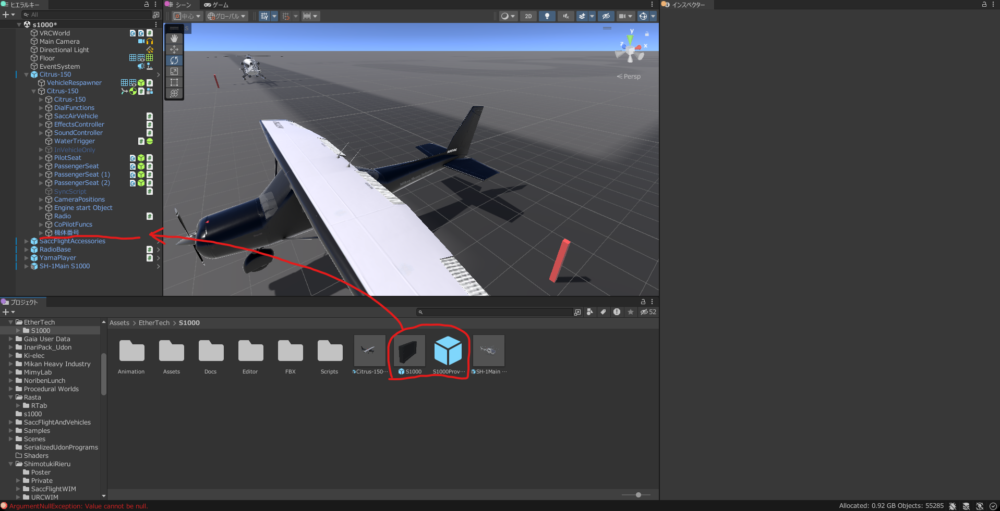
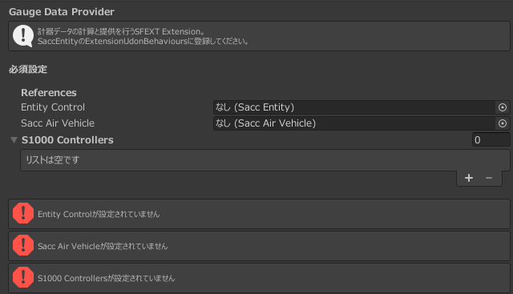
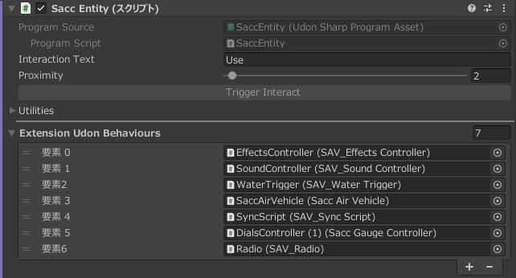

import { File, Folder, Files } from 'fumadocs-ui/components/files';

## セットアップ手順

## 1. ダウンロード
Boothより、S1000を購入してダウンロードしてください。

<Card title="S1000 on Booth" href="https://rierun.booth.pm/items/7920865" />

## 2. Unityプロジェクトへの導入

ダウンロードしたZIPファイルを解凍し、`S1000.unitypackage`をUnityプロジェクトにインポートしてください。

インポート後は次のようなフォルダ構成になっているはずです。

<Files>
    <Folder name="Assets" defaultOpen>
        <Folder name="EtherTech" defaultOpen>
            <Folder name="S1000" defaultOpen>
                <Folder name="Animation"/>
                <Folder name="Assets"/>
                <Folder name="Docs"/>
                <Folder name="Editor"/>
                <Folder name="FBX"/>
                <Folder name="Scripts"/>
                <File name="S1000" />
                <File name="S1000Provider" />
                <File name="SH-1Main S1000" />
            </Folder>
        </Folder>
    </Folder>
</Files>

## 3. 機体にS1000を組み込む
1. **プレハブの配置**  
S1000を組み込みたい機体のGameObjectの中に、`S1000`と`S1000Provider`プレハブを配置してください。

2. **コンポーネントの設定**  
<Tabs items={['自動設定', '手動設定']}>
    <Tab value="自動設定">
        コンポーネント内にある **「自動割当」** をクリックしてください。
多くの場合、これで必要な参照が自動的に割り当てられます。
    </Tab>
    <Tab value="手動設定">
        自動設定で参照が埋まらない場合や、個別にカスタマイズしたい場合は、以下の表を参考に各項目をアタッチしてください。

| 項目 | 設定内容 |
| :--- | :--- |
| **Entity** | 機体の親オブジェクト（SaccEntity等があるGameObject） |
| **Sacc Air Vehicle** | 機体の `SaccAirVehicle` スクリプト |
| **S1000 Controllers** | シーン内に配置した `S1000` プレハブ |
| **SAV Radio** (任意) | `SAV_Radio` スクリプト（無線機能を使用する場合のみ） |

    </Tab>
</Tabs>

3. **SaccEntityへの登録**  
また、機体のGameObject内にある`SaccEntity`コンポーネント内の`Extension Udon Behaviours`に、`S1000Provider`プレハブをアタッチしてください。

あとは、S1000の位置を調整すれば、基本的なセットアップは完了です。

<Callout type="info">
`S1000` オブジェクト内の **Flip Heading** 設定を切り替えることで、機体の正面方向（Z軸）に合わせて表示を反転させることが可能です。
</Callout>

これで導入は完了です。Playモードにして、S1000が正しく動作するか確認してください。